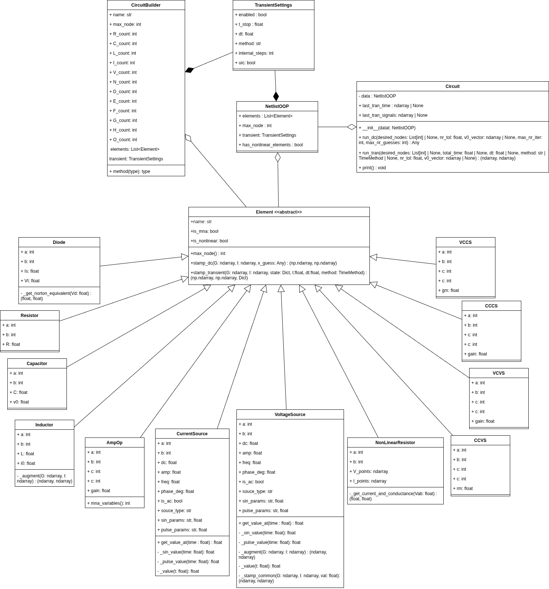
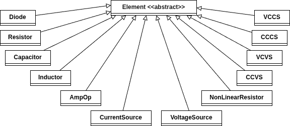
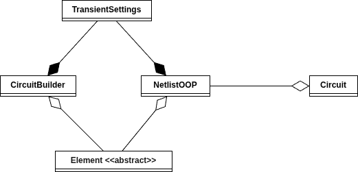

================
Diagrama de Classes
================

Hierarquia de Classes de Elementos
-----------------------------------

O Circuit Simulator MNA utiliza uma arquitetura orientada a objetos com herança e polimorfismo. A hierarquia de classes demonstra os princípios de encapsulamento e reutilização de código.

Diagrama UML
------------

O Diagrama acima representa todas as relações do circuito.

Descrição das Classes de Elementos
---------------------------

O diagrama de classes acima representa uma versão simplificada do simulador, ilustrando somente a relação entre os elementos de circuito e suas heranças.

Element (Classe Abstrata Base)
~~~~~~~~~~~~~~~~~~~~~~~~~~~~~~~

**Responsabilidade**: Define interface comum para todos os elementos de circuito.

**Atributos**:
  - ``name: str`` - Nome do elemento: tipo + numeração
  - ``is_mna: bool =  False`` - Determina se o elemento adiciona uma nova variável ao sistema. Por padrão, é falso
  - ``is_nonlinear: bool = False`` - Determina se o elemento precisa de resolução usando Newton-Raphson. Por padrão, é falso.

**Métodos**:
  - ``max_node() -> int`` - Retorna o maior nó de sua composição
  - ``stamp_dc(G, I, x_guess) → (G, I)`` - Stamp para análise DC
  - ``stamp_transient(G, I, state, t, dt, method, x_guess) → (G, I, state)`` - Stamp transiente

Elementos Lineares
---------------------------

Resistor
~~~~~~~~~~~~~~~~~~~~~~~~~~~~~~~~

**Herda de**: ``Element``

**Responsabilidade**: Representa o elemento Resistor do sistema.

**Características**:
  - ``a: int`` - Nó positivo
  - ``b: int`` - Nó negativo
  - ``R: float`` - Resistencia do componente

Capacitor
~~~~~~~~~~~~~~~~~~~~~~~~~~~~~~~~

**Herda de**: ``Element``

**Responsabilidade**: Representa o elemento Capacitivo do sistema.

**Características**:
  - ``a: int`` - Nó positivo
  - ``b: int`` - Nó negativo
  - ``C: float`` - Capacitancia do componente
  - ``v0: float = 0.0`` - Carga inicial do componente. Por padrão é 0.

Indutor
~~~~~~~~~~~~~~~~~~~~~~~~~~~~~~~~

**Herda de**: ``Element``

**Responsabilidade**: Representa o elemento Indutivo do sistema.

**Características**:
  - ``a: int`` - Nó positivo
  - ``b: int`` - Nó negativo
  - ``R: float`` - Indutancia do componente
  - ``i0: float = 0.0`` - Corrente inicial do componente. Por padrão é 0.
  - ``is_mna: ClassVar[bool] = True`` - Indica que o componente adiciona mais uma variável 

**Métodos**:
  - ``_augment(G, I) : (G, I)`` -  Adiciona uma variável à matriz 

Elementos Não-Lineares
---------------------------

Resistor Não Linear
~~~~~~~~~~~~~~~~~~~~~~~~~~~~~~~~

**Herda de**: ``Element``

**Responsabilidade**: Representa um resistor descrito por trechos lineares definidos por pontos (V, I).  
É utilizado em simulações que requerem comportamento não linear arbitrário.

**Características**:
  - ``a: int`` — Nó positivo  
  - ``b: int`` — Nó negativo  
  - ``V_points: np.ndarray`` — Vetor de tensões definindo a curva não linear  
  - ``I_points: np.ndarray`` — Vetor de correntes correspondente às tensões  
  - ``is_nonlinear: bool = True`` — Indica que o elemento requer Newton-Raphson

**Métodos** (além da interface base):
  - ``_get_current_and_conductance(Vab) -> (I_nr, G_eq)``  
    Calcula, para uma tensão ``Vab`` aplicada entre os nós ``a`` e ``b``, o **modelo equivalente de Norton** do resistor não linear.  
    O método:
      * identifica em qual segmento da curva V–I a tensão ``Vab`` se encontra;  
      * calcula a condutância equivalente ``G_eq`` como a inclinação do trecho (derivada aproximada dI/dV);  
      * obtém a corrente do resistor no ponto (interpolada) e converte isso em uma fonte de corrente equivalente ``I_nr`` para o modelo de Norton.  
  - ``stamp_dc(G, I, x_guess) -> (G, I)``  
    Usa o chute de tensão ``x_guess`` para obter ``Vab``, chama ``_get_current_and_conductance`` e estampa a condutância e a fonte de corrente equivalentes na matriz ``G`` e no vetor ``I`` da análise DC.  
  - ``stamp_transient(G, I, state, t, dt, method, x_guess) -> (G, I, state)``  
    Reutiliza a mesma lógica da análise DC (não há memória interna), estampando o modelo de Norton a cada passo de tempo.

**Comportamento**:
  - Lineariza a curva V–I no ponto de operação corrente usando um modelo de Norton equivalente.  
  - Utiliza o chute atual do solver Newton-Raphson para determinar a condutância local e a fonte de corrente equivalente, garantindo convergência incremental da solução.

Diodo
~~~~~~~~~~~~~~~~~~~~~~~~~~~~~~~~
**Herda de**: ``Element``

**Responsabilidade**: Modela um diodo semicondutor usando a equação de Shockley, linearizado a cada iteração via modelo de Norton para permitir solução pelo método de Newton-Raphson.

**Características**:
  - ``a: int`` — Nó ânodo  
  - ``b: int`` — Nó cátodo  
  - ``Is: float`` — Corrente de saturação do diodo  
  - ``Vt: float`` — Tensão térmica (tipicamente em torno de 25 mV)  
  - ``is_nonlinear: ClassVar[bool] = True`` — Indica que o elemento é não linear e exige Newton-Raphson

**Métodos** (além da interface base):
  - ``_get_norton_equivalent(Vd) -> (I_eq, Gd)``  
    A partir da tensão direta ``Vd`` aplicada ao diodo, calcula a condutância incremental ``Gd`` e a corrente equivalente ``I_eq`` para o modelo de Norton linearizado. O método também realiza *clamping* de ``Vd`` em valores altos para garantir estabilidade numérica.  
  - ``stamp_dc(G, I, x_guess) -> (G, I)``  
    Usa o chute de tensão ``x_guess`` para obter ``Vd = x_guess[a] - x_guess[b]``, chama ``_get_norton_equivalent`` e estampa a condutância e a fonte de corrente equivalentes na matriz ``G`` e no vetor ``I`` da análise DC.  
  - ``stamp_transient(G, I, state, t, dt, method, x_guess) -> (G, I, state)``  
    Reutiliza a mesma lógica de ``stamp_dc``, pois o diodo não possui estado de memória (seu comportamento é puramente estático em cada instante).

**Comportamento**:
  - Lineariza o diodo em torno do ponto de operação atual com um modelo Norton dependente de ``Vd``.  
  - Depende do vetor de chute do Newton-Raphson para atualizar a condutância e a fonte de corrente equivalentes a cada iteração.

Fontes Independentes
---------------------------

Fonte de Corrente
~~~~~~~~~~~~~~~~~~~~~~~~~~~~~~~~
**Herda de**: ``Element``

**Responsabilidade**: Representa fontes de corrente independentes, incluindo formas de onda DC, AC, senoide amortecida e pulso periódico.

**Características**:
  - ``a: int`` — Nó onde a corrente sai (sentido de referência)  
  - ``b: int`` — Nó onde a corrente entra  
  - ``dc: float`` — Componente DC da fonte  
  - ``amp: float`` — Amplitude AC ou de variação da forma de onda  
  - ``freq: float`` — Frequência (para modos AC/SIN/PULSE, quando aplicável)  
  - ``phase_deg: float`` — Fase em graus (para AC/SIN)  
  - ``is_ac: bool`` — Indica se a fonte é AC  
  - ``source_type: str`` — Tipo da fonte (``"DC"``, ``"AC"``, ``"SIN"``, ``"PULSE"``)  
  - ``sin_params`` — Dicionário de parâmetros da forma ``SIN``  
  - ``pulse_params`` — Dicionário de parâmetros da forma ``PULSE``  

**Métodos** (além da interface base):
  - ``get_value_at(time) -> float``  
    Retorna o valor instantâneo da corrente da fonte no tempo especificado, despachando para a forma de onda correta conforme ``source_type``.  
  - ``_sin_value(time) -> float``  
    Implementa a expressão da forma de onda senoidal amortecida, considerando atraso, amortecimento e fase.  
  - ``_pulse_value(time) -> float``  
    Implementa uma forma de onda de pulso retangular com tempos de subida/descida, largura e período.  
  - ``_value(t) -> float``  
    Método de compatibilidade interna que encaminha para ``get_value_at``.  
  - ``stamp_dc(G, I, x_guess) -> (G, I)``  
    Estampa a corrente DC equivalente, injetando corrente em ``b`` e retirando de ``a``.  
  - ``stamp_transient(G, I, state, t, dt, method, x_guess) -> (G, I, state)``  
    Calcula a corrente instantânea no tempo ``t`` e estampa a contribuição correspondente para a análise transiente.

Fonte de Tensão
~~~~~~~~~~~~~~~~~~~~~~~~~~~~~~~~

**Herda de**: ``Element``

**Responsabilidade**: Representa fontes de tensão independentes com suporte a modos DC, AC, senoide amortecida e pulso, adicionando variáveis MNA para a corrente da fonte.

**Características**:
  - ``a: int`` — Nó positivo  
  - ``b: int`` — Nó negativo  
  - ``dc: float = 0.0`` — Componente DC da fonte  
  - ``amp: float = 0.0`` — Amplitude AC ou da forma de onda  
  - ``freq: float = 0.0`` — Frequência associada à forma de onda  
  - ``phase_deg: float = 0.0`` — Fase em graus (para AC/SIN)  
  - ``is_ac: bool = False`` — Indica se a fonte é AC  
  - ``source_type: str = "DC"`` — Tipo da fonte (``"DC"``, ``"AC"``, ``"SIN"``, ``"PULSE"``)  
  - ``sin_params: dict | None`` — Parâmetros adicionais para a forma ``SIN``  
  - ``pulse_params: dict | None`` — Parâmetros adicionais para a forma ``PULSE``  
  - ``is_mna: ClassVar[bool] = True`` — Indica que o elemento adiciona uma variável MNA (corrente da fonte)

**Métodos** (além da interface base):
  - ``get_value_at(time) -> float``  
    Retorna o valor instantâneo da tensão da fonte no tempo especificado, com base em ``source_type`` e nos parâmetros configurados (DC, AC, SIN ou PULSE).  
  - ``_sin_value(time) -> float``  
    Implementa a forma ``SIN(V_offset V_amplitude freq delay damping phase)``, incluindo atraso, amortecimento exponencial e fase em radianos.  
  - ``_pulse_value(time) -> float``  
    Implementa a forma ``PULSE(v1 v2 delay rise_time fall_time pulse_width period)``, gerando o valor de tensão em cada fase: repouso, subida, nível alto, descida e repetição periódica.  
  - ``_value(t) -> float``  
    Função auxiliar de compatibilidade que simplesmente delega para ``get_value_at``.  
  - ``_augment(G, I) -> (G2, I2)``  
    Expande a matriz de condutâncias ``G`` e o vetor de correntes ``I`` para adicionar uma nova variável MNA correspondente à corrente da fonte de tensão.  
  - ``_stamp_common(G, I, val) -> (G, I)``  
    Estampa a estrutura MNA padrão de uma fonte de tensão: adiciona as equações KCL nos nós ``a`` e ``b`` e uma equação para a diferença de potencial imposta, usando o valor ``val``.  
  - ``stamp_dc(G, I, x_guess) -> (G, I)``  
    Chama ``_stamp_common`` usando o valor DC da fonte (ou o valor da forma de onda em ``t = 0``) para a análise de regime permanente.  
  - ``stamp_transient(G, I, state, t, dt, method, x_guess) -> (G, I, state)``  
    Calcula o valor instantâneo da fonte em ``t`` e chama ``_stamp_common`` para estampar sua contribuição na análise transiente.

**Comportamento**:
  - Em DC, atua como uma fonte de tensão constante, adicionando uma variável MNA para a corrente de ramo.  
  - Em transiente, gera valores temporais de tensão coerentes com a forma de onda definida, permitindo simular sinais periódicos, degraus, pulsos e formas senoidais amortecidas.

Fontes Controntroladas
---------------------------

VCVS – Voltage Controlled Voltage Source
~~~~~~~~~~~~~~~~~~~~~~~~~~~~~~~~

**Herda de**: ``Element``

**Responsabilidade**: Fonte de tensão cuja saída é proporcional à diferença de tensão em um par de nós de controle.

**Características**:
  - ``a, b`` — Nós de saída  
  - ``c, d`` — Nós de controle  
  - ``gain: float`` — Ganho de tensão (Av)  
  - ``is_mna: bool = True`` — Adiciona uma variável MNA para controlar a relação entre saída e controle

**Métodos**:
  - ``stamp_dc(G, I, x_guess) -> (G, I)``  
    Expande o sistema MNA para incluir uma variável associada à fonte e impõe a equação  
    ``v_a − v_b = gain * (v_c − v_d)``, além da KCL nos nós de saída.  
  - ``stamp_transient(G, I, state, t, dt, method, x_guess) -> (G, I, state)``  
    Reutiliza o mesmo estampamento da análise DC (elemento sem estado interno).

CCCS – Current Controlled Current Source
~~~~~~~~~~~~~~~~~~~~~~~~~~~~~~~~
**Herda de**: ``Element``

**Responsabilidade**: Implementa uma fonte de corrente cuja saída é proporcional à corrente que circula em um ramo de controle.

**Características**:
  - ``a, b: int`` — Nós de saída da fonte de corrente controlada  
  - ``c, d: int`` — Nós do ramo de controle onde a corrente é medida  
  - ``gain: float`` — Ganho de corrente (fator de proporcionalidade entre corrente de saída e corrente de controle)  
  - ``is_mna: ClassVar[bool] = True`` — Requer introdução de variável MNA para medir a corrente de controle

**Métodos** (além da interface base):
  - ``stamp_dc(G, I, x_guess) -> (G, I)``  
    Expande a matriz MNA para adicionar uma variável associada à corrente de controle.  
    Estampa:
      * a relação entre a corrente de saída e a variável de corrente medida no ramo de controle, via ``gain``;  
      * uma fonte de tensão auxiliar no ramo de controle (para possibilitar medição de corrente);  
      * as equações de KCL e a equação de acoplamento entre o ramo de controle e o ramo de saída.  
  - ``stamp_transient(G, I, state, t, dt, method, x_guess) -> (G, I, state)``  
    Reutiliza o mesmo estampamento da análise DC, pois não há estados internos dependentes do tempo.

**Comportamento**:
  - A corrente de saída entre ``a`` e ``b`` é calculada como ``I_out = gain * I_control``, onde ``I_control`` é a corrente medida no ramo entre ``c`` e ``d``.  
  - A estrutura MNA adicionada garante a coerência entre a corrente medida no ramo de controle e a corrente imposta no ramo de saída.

VCCS – Voltage Controlled Current Source
~~~~~~~~~~~~~~~~~~~~~~~~~~~~~~~~

**Herda de**: ``Element``

**Responsabilidade**: Fonte de corrente que injeta corrente proporcional à diferença de tensão em um par de nós de controle.

**Características**:
  - ``a, b`` — Nós de saída  
  - ``c, d`` — Nós de controle  
  - ``gm: float`` — Transcondutância (Siemens)  
  - ``is_mna: bool = False`` — Não adiciona variáveis MNA extras, apenas modifica diretamente ``G``

**Métodos**:
  - ``stamp_dc(G, I, x_guess) -> (G, I)``  
    Estampa as condutâncias equivalentes que fazem a corrente entre ``a`` e ``b`` depender da tensão entre ``c`` e ``d``, através de ``gm``.  
  - ``stamp_transient(G, I, state, t, dt, method, x_guess) -> (G, I, state)``  
    Reutiliza a estampa DC (elemento puramente estático).

CCVS – Current Controlled Voltage Source
~~~~~~~~~~~~~~~~~~~~~~~~~~~~~~~~

**Herda de**: ``Element``

**Responsabilidade**: Implementa uma fonte de tensão cuja diferença de potencial de saída é proporcional à corrente que circula em um ramo de controle.

**Características**:
  - ``a, b: int`` — Nós de saída da fonte de tensão  
  - ``c, d: int`` — Nós do ramo de controle onde a corrente é medida  
  - ``rm: float`` — Trans-resistência (Ohms), relacionando tensão de saída e corrente de controle  
  - ``is_mna: ClassVar[bool] = True`` — Adiciona duas variáveis MNA (corrente de controle e corrente de saída)

**Métodos** (além da interface base):
  - ``stamp_dc(G, I, x_guess) -> (G, I)``  
    Expande a matriz MNA para introduzir:
      * uma variável de corrente no ramo de controle;  
      * uma variável de corrente no ramo de saída;  
      * equações de KCL nos nós de controle ``c`` e ``d`` e nos nós de saída ``a`` e ``b``;  
      * uma equação que força o ramo de controle a comportar-se como um curto-circuito ideal para medição de corrente;  
      * a equação de saída: ``v_a − v_b = rm * i_control``, ligando a tensão de saída à corrente de controle.  
  - ``stamp_transient(G, I, state, t, dt, method, x_guess) -> (G, I, state)``  
    Reutiliza o mesmo estampamento da análise DC, uma vez que o elemento não possui dinâmica de estado.

**Comportamento**:
  - A tensão entre ``a`` e ``b`` é dada por ``V_out = rm * I_control``, permitindo modelar elementos como amplificadores de trans-resistência ideais.  
  - A estrutura MNA adicionada garante a correta medição da corrente de controle e a imposição da tensão de saída correspondente.

OpAmp - Operational Amplifier
---------------------------
**Herda de**: ``Element``

**Responsabilidade**: Modela um amplificador operacional ideal como uma fonte controlada de tensão de ganho muito alto, adequado para análise de circuitos com realimentação.

**Características**:
  - ``a: int`` — Nó de saída positivo  
  - ``b: int`` — Nó de saída negativo  
  - ``c: int`` — Entrada não inversora  
  - ``d: int`` — Entrada inversora  
  - ``gain: float = 1e5`` — Ganho de malha aberta elevado  
  - ``is_mna: bool = True`` — Indica que adiciona equação MNA

**Métodos** (além da interface base):
  - ``mna_variables() -> int``  
    Informa explicitamente que este elemento adiciona **uma** variável MNA ao sistema (corrente interna associada ao opamp).  
  - ``stamp_dc(G, I, x_guess) -> (G, I)``  
    Expande a matriz MNA para adicionar a variável do opamp, estampa KCL nos nós de saída e a equação de controle  
    ``v_a − v_b − gain * (v_c − v_d) = 0``.  
  - ``stamp_transient(G, I, state, t, dt, method, x_guess) -> (G, I, state)``  
    Reutiliza o mesmo estampamento da análise DC, pois o opamp é modelado como ideal, sem dinâmica interna adicional.

Descrição de Relacionamento Entre as Demais Classes
---------------------------

O diagrama acima apresenta os relacionamentos entre as classes de alto nível do simulador:

- ``TransientSettings`` ---<> ``NetlistOOP`` (**composição**)  
  As configurações de transiente fazem parte intrínseca da netlist e são criadas junto com ela. Sem uma netlist, essas configurações perdem sentido, por isso o ciclo de vida de ``TransientSettings`` é controlado por ``NetlistOOP``.

- ``TransientSettings`` ---<> ``CircuitBuilder`` (**composição**)  
  Da mesma forma, o construtor de circuitos mantém internamente um objeto ``TransientSettings`` que representa as escolhas de simulação transiente do circuito em construção. Esse objeto é criado e gerenciado pelo próprio ``CircuitBuilder``.

- ``Element`` ---<> ``NetlistOOP`` (**agregação**)  
  A netlist mantém uma lista de elementos de circuito (resistores, fontes, etc.), mas não é responsável exclusiva pela criação da classe base ``Element``. Cada elemento pode, em princípio, ser compartilhado ou criado fora da netlist e depois associado a ela.

- ``Element`` ---<> ``CircuitBuilder`` (**agregação**)  
  O ``CircuitBuilder`` também mantém uma lista de ``Element`` para montar o circuito, mas apenas agrega essas instâncias: ele as cria, remove ou exporta, mas o conceito de elemento não depende do builder em si.

- ``NetlistOOP`` ---<> ``Circuit`` (**agregação**)  
  A classe ``Circuit`` recebe um objeto ``NetlistOOP`` pronto no construtor e o utiliza como fonte de dados para simulação. O circuito consome a netlist, mas não controla sua criação nem a existência independente dela, caracterizando um relacionamento de agregação.

NetlistOOP
~~~~~~~~~~~~~~~~~~~~~~~~~~~~~~~~

**Tipo de relacionamento**:
  - ``composition`` com ``TransientSettings`` (netlist contém e gerencia suas configurações de transiente)
  - ``aggregation`` com ``Element`` (netlist agrega uma lista de elementos de circuito)
  - ``aggregation`` com ``Circuit`` (é consumida por ``Circuit`` para simulação)

**Responsabilidade**:
  Representar a netlist em formato orientado a objetos, reunindo em uma única estrutura:
  - a lista de elementos de circuito (passivos, fontes, elementos não lineares, etc.);
  - o número máximo de nó do circuito;
  - as configurações de simulação transiente;
  - a indicação se existem elementos não lineares.

**Características**:
  - ``elements: List[Element]`` — Lista de elementos de circuito associados à netlist.  
  - ``max_node: int`` — Maior índice de nó presente no circuito.  
  - ``transient: TransientSettings`` — Configurações de simulação transiente associadas a esta netlist.  
  - ``has_nonlinear_elements: bool`` — Indica se há elementos não lineares no circuito, otimizando o uso do solver Newton-Raphson.

**Métodos**:
  A classe é um ``dataclass`` simples, sem métodos próprios além dos gerados automaticamente (construtor, comparação etc.).  
  A lógica de simulação é conduzida por outras classes (como ``Circuit``) e funções do módulo de engine, que consomem a instância de ``NetlistOOP``.

**Comportamento**:
  - Atua como contêiner de dados do circuito, mantendo os elementos e as configurações de simulação.  
  - É a principal estrutura intercambiável entre o parser de netlist, o ``CircuitBuilder`` e a classe ``Circuit``, servindo de “modelo” do circuito para as análises DC e transiente.

TransientSettings
~~~~~~~~~~~~~~~~~~~~~~~~~~~~~~~~

**Tipo de relacionamento**:
  - ``composition`` com ``NetlistOOP`` (a netlist sempre possui um conjunto de configurações de transiente associado)  
  - ``composition`` com ``CircuitBuilder`` (o builder mantém suas próprias configurações de transiente para o circuito em construção)

**Responsabilidade**:
  Descrever as configurações de simulação transiente, como tempo final, passo de integração e método numérico utilizado.

**Características**:
  - ``enabled: bool`` — Indica se a simulação transiente está habilitada.  
  - ``t_stop: float`` — Tempo final da simulação.  
  - ``dt: float`` — Passo de tempo nominal entre amostras salvas.  
  - ``method: str = "BE"`` — Método numérico de integração (``"BE"`` para Backward Euler, ``"FE"`` para Forward Euler, ``"TRAP"`` para Trapézio).  
  - ``intetnal_steps: int`` — Número de subpassos internos entre amostras gravadas, quando aplicável.  
  - ``uic: bool`` — Define se são usadas condições iniciais (``Use Initial Conditions``) em elementos como capacitores e indutores.

**Métodos**:
  Não define métodos além dos gerados automaticamente pelo ``dataclass``.  
  A interpretação desses campos (por exemplo, qual método numérico usar) é feita pela classe ``Circuit`` e pelas rotinas do módulo de engine.

**Comportamento**:
  - Funciona como um objeto de configuração que parametriza a simulação transiente.  
  - Pode ser atualizado pelo ``CircuitBuilder`` ou por código de alto nível antes da chamada da simulação.  
  - Quando combinado com ``NetlistOOP``, permite que a simulação transiente seja reproduzível e totalmente especificada em um único objeto.

Circuit
~~~~~~~~~~~~~~~~~~~~~~~~~~~~~~~~

**Tipo de relacionamento**:
  - ``aggregation`` com ``NetlistOOP`` (``Circuit`` consome uma netlist já construída para realizar as simulações)

**Responsabilidade**:
  Realizar as simulações de análise DC e transiente a partir de uma netlist orientada a objetos, armazenando os resultados para visualização ou pós-processamento.

**Características**:
  - ``data: NetlistOOP`` — Netlist OOP a ser utilizada como base para simulação.  
  - ``last_tran_time: np.ndarray | None`` — Vetor de tempos da última simulação transiente executada.  
  - ``last_tran_signals: dict[str, np.ndarray] | None`` — Dicionário de sinais (tensões de nós e correntes de elementos) da última simulação transiente.

**Métodos**:
  - ``__init__(data: NetlistOOP)``  
    Recebe uma netlist OOP e inicializa a estrutura interna do circuito, sem copiar os dados.  
  - ``run_dc(desired_nodes=None, nr_tol: float = 1e-8, v0_vector=None, max_nr_iter: int = 50, max_nr_guesses: int = 100)``  
    Executa a análise DC usando o solver de engine. Resolve o sistema MNA, com suporte a Newton-Raphson e múltiplos chutes aleatórios, retornando as tensões nos nós desejados.  
  - ``run_tran(desired_nodes=None, total_time: float | None = None, dt: float | None = None, method: str | TimeMethod | None = None, nr_tol: float = 1e-8, v0_vector=None)``  
    Executa a análise transiente, utilizando como padrão as configurações contidas em ``data.transient`` quando os parâmetros não são informados explicitamente. Retorna o vetor de tempos e a matriz de tensões nos nós. Também preenche ``last_tran_time`` e ``last_tran_signals``.  
  - ``print()``  
    Imprime no terminal um resumo dos elementos do circuito e, se habilitado, as configurações de transiente atuais.

**Comportamento**:
  - Encapsula a lógica de simulação, delegando a montagem do sistema e a resolução numérica ao módulo de engine (``solve_dc`` e ``solve_tran``).  
  - Usa ``NetlistOOP`` como fonte única de verdade para o circuito (elementos, nós e configurações de transiente).  
  - Armazena resultados de simulação para uso posterior (por exemplo, exportação, gráficos ou scripts de análise).

CircuitBuilder
~~~~~~~~~~~~~~~~~~~~~~~~~~~~~~~~

**Tipo de relacionamento**:
  - ``composition`` com ``TransientSettings`` (mantém internamente as configurações de transiente do circuito em construção)  
  - ``aggregation`` com ``Element`` (constrói e mantém uma lista de elementos de circuito)  
  - Indiretamente associado a ``NetlistOOP`` via método ``to_netlist_oop()``, que materializa o circuito em um objeto de netlist.

**Responsabilidade**:
  Fornecer uma interface de alto nível para montar circuitos programaticamente, adicionando elementos, configurando simulação transiente, removendo componentes e exportando o resultado como netlist em texto ou como objeto ``NetlistOOP``.

**Características**:
  - ``name: str`` — Nome lógico do circuito (usado em arquivos e identificação).  
  - ``max_node: int`` — Maior índice de nó utilizado até o momento no circuito em construção.  
  - Contadores de elementos (``R_count, C_count, L_count, I_count, V_count, N_count, D_count, E_count, F_count, G_count, H_count, O_count``) — Usados para gerar nomes únicos (R1, R2, C1, V1, etc.).  
  - ``elements: List[Element]`` — Lista de elementos adicionados ao circuito.  
  - ``transient: TransientSettings`` — Configurações de simulação transiente associadas a este circuito em construção.

**Métodos**:
  - ``rename(new_name: str)``  
    Atualiza o nome lógico do circuito.  
  - ``_update_max_node(*nodes: int)``  
    Método auxiliar interno para manter ``max_node`` consistente sempre que novos elementos são adicionados.  

  **Adição de componentes**:
  - ``add_resistor(a, b, R)`` — Adiciona um resistor.  
  - ``add_capacitor(a, b, C, ic=0.0)`` — Adiciona um capacitor, com condição inicial opcional.  
  - ``add_inductor(a, b, L, ic=0.0)`` — Adiciona um indutor, com corrente inicial opcional.  
  - ``add_current_source_dc(...)`` e ``add_current_source_ac(...)`` — Adicionam fontes de corrente DC e AC.  
  - ``add_voltage_source_dc(...)``, ``add_voltage_source_ac(...)``, ``add_voltage_source_sin(...)``, ``add_voltage_source_pulse(...)`` — Adicionam fontes de tensão em diversos formatos (DC, AC, senoide, pulso).  
  - ``add_vcvs(...)``, ``add_cccs(...)``, ``add_vccs(...)``, ``add_ccvs(...)`` — Adicionam fontes controladas de tensão e corrente (VCVS, CCCS, VCCS, CCVS).  
  - ``add_opamp(vp, vn, vo, gain=1e5)`` — Adiciona um amplificador operacional ideal.  
  - ``add_nonlinear_resistor(a, b, V_points, I_points)`` — Adiciona um resistor não linear definido por quatro pontos (V, I).  
  - ``add_diode(a, b)`` — Adiciona um diodo idealizado.

  **Manipulação de componentes**:
  - ``remove_component(index: int) -> bool``  
    Remove um componente pelo índice (1-based) na lista de elementos, atualizando ``max_node`` com base nos elementos restantes.

  **Configuração de simulação**:
  - ``set_transient(t_stop, dt, method="BE", internal_steps=1, uic=True)``  
    Configura as propriedades de ``transient`` (tempo final, passo, método, subpassos, uso de condições iniciais).  
  - ``enable_transient(enabled: bool = True)``  
    Habilita ou desabilita a simulação transiente para o circuito em construção.

  **Exportação**:
  - ``save_netlist(file_path: str)``  
    Salva o circuito em um arquivo `.net`, escrevendo o número de nós, os elementos em formato textual e, se habilitado, uma linha final ``.TRAN`` com as configurações de transiente.  
  - ``to_netlist_oop() -> NetlistOOP``  
    Constrói e retorna um objeto ``NetlistOOP`` a partir do estado atual do builder, copiando a lista de elementos e reutilizando as configurações de transiente.

**Comportamento**:
  - Funciona como uma “fábrica” de circuitos, permitindo construir, alterar e exportar circuitos de forma incremental e programática.  
  - Usa ``TransientSettings`` por composição para manter as configurações de transiente coesas com o circuito em construção.  
  - Agrega elementos de circuito (``Element`` e subclasses) para formar a topologia elétrica.  
  - Quando necessário, converte o circuito construído em um objeto ``NetlistOOP`` ou em um arquivo de netlist compatível com o parser e com a classe ``Circuit``.  

Encapsulamento e Abstração
---------------------------

Princípios Aplicados
~~~~~~~~~~~~~~~~~~~~

1. **Encapsulamento**:
   - Atributos privados/protegidos via convenção
   - Métodos públicos bem definidos
   - Estado interno (``state``) gerenciado internamente

2. **Herança**:
   - Hierarquia clara de classes
   - Reutilização de código nas classes base
   - Especialização em subclasses

3. **Polimorfismo**:
   - Mesma interface (``stamp_dc``, ``stamp_transient``) para todos elementos
   - Engine processa elementos polimorficamente
   - Permite adicionar novos elementos sem modificar engine

4. **Abstração**:
   - Classes abstratas definem contratos
   - Detalhes de implementação ocultados
   - Interface limpa para o usuário

Exemplo de Uso Polimórfico
---------------------------

.. code-block:: python

   def assemble_mna(elements: List[Element], num_nodes: int):
       G = np.zeros((num_nodes, num_nodes))
       I = np.zeros(num_nodes)
       
       for elem in elements:
           # Polimorfismo: cada elemento implementa seu stamp
           G, I = elem.stamp_dc(G, I)
       
       return G, I

Independente do tipo concreto de elemento, o código funciona graças ao polimorfismo.

Diagrama de Sequência - Análise DC
-----------------------------------

.. code-block:: text

   User → Circuit.run_dc()
           ↓
   Circuit → engine.solve_dc(netlist)
                   ↓
   Engine → parse elements
                   ↓
   Engine → assemble_mna(elements)
                   ↓
   [for each element]
       Element.stamp_dc(G, I)  # Polimorfismo
                   ↓
   Engine → newton_raphson_retry(...)
                   ↓
   Newton → [Iterações]
       - Avalia i_nl() para não-lineares
       - Calcula Jacobiano
       - Resolve sistema linear
       - Atualiza x
                   ↓
   Newton → return voltages
                   ↓
   Engine → return voltages
                   ↓
   Circuit → return voltages
                   ↓
   User ← resultado

Benefícios da Arquitetura OOP
------------------------------

1. **Manutenibilidade**: Código organizado e fácil de entender
2. **Extensibilidade**: Novos elementos via herança sem quebrar código existente
3. **Testabilidade**: Componentes isolados são fáceis de testar
4. **Reutilização**: Código compartilhado nas classes base
5. **Flexibilidade**: Polimorfismo permite tratar elementos uniformemente
